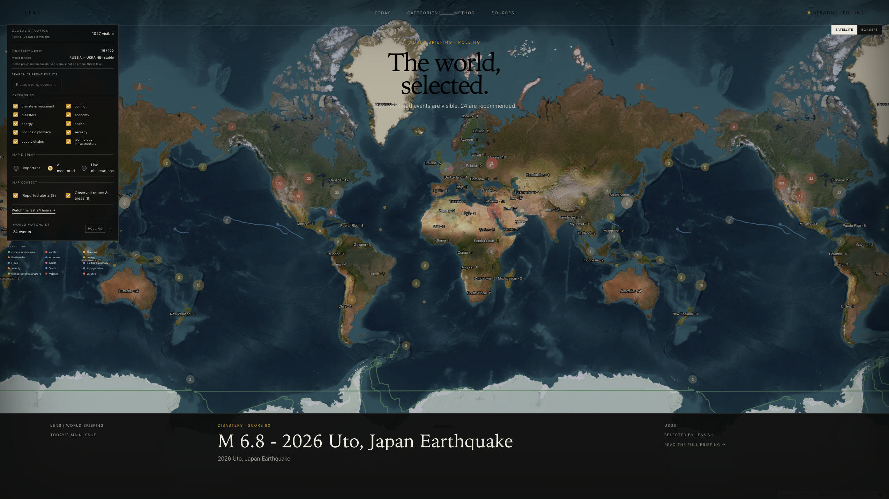

# LENS

**A live world briefing that explains what matters, where it is happening, and why it was selected.**

[Open the live world briefing](https://theworldlens.up.railway.app)

Most world-monitoring tools are built like analyst terminals: hundreds of markers, layers, feeds, and controls compete for attention. LENS keeps the useful real-time infrastructure but changes the public experience into an editorial sequence—overview, event story, evidence, score, change over 24 hours, and source.

LENS is an independent open-source project. It is not affiliated with or
endorsed by World Monitor. The default build collects and explains curated
free public feeds itself using an attributed subset of World Monitor's public
AGPL news pipeline. The hosted World Monitor adapter is optional and disabled
without an API key. Direct USGS and NASA EONET integrations keep
natural-hazard coverage useful independently.



## What is implemented

- A map-led, responsive briefing with five-chapter event stories.
- Three map views: editorially important events, every active mapped event,
  and structured live observations.
- Ten fixed public-interest categories with explicit unscored states.
- Forty curated RSS/Atom feeds with fuzzy story identity, general incident merging, independent feed
  health, honest geography, attributable images, and `wm-lens-news-v1`
  importance scoring.
- Direct USGS and NASA EONET activity layers plus optional authenticated WorldMonitor adapters.
- Public PizzINT activity and GDELT bilateral-tension proxies, cached server-side
  and explicitly separated from verified alerts.
- Independent, non-overlapping provider schedules and per-provider degradation.
- Canonical observations, evidence, cross-provider clustering, SQLite snapshots, and SSE updates.
- Transparent `lens-v1` scoring, diversity-aware selection, 24-hour playback, source-derived timeline markers, and source trails.
- Optional Kystverket/BarentsWatch vessel-history enrichment for an already selected event.
- A 200-candidate controlled evaluation replay across all ten categories.
- A separately labeled USGS source-observation sample that checks incident merging.
- Real-Chrome route, keyboard, fallback, and serious/critical WCAG checks.

## Run the deterministic fixture

Requires Node.js 22 or newer.

```sh
npm install
npm run replay -- --fixture tests/fixtures/replay/baseline.json
```

The command prints one deterministic briefing snapshot as JSON. It does not call external services and is the fastest way to inspect the selection pipeline.

## Run the web experience

In two terminals:

```sh
npm run dev:server
```

```sh
npm run dev
```

Open <http://127.0.0.1:5173>. The API defaults to <http://127.0.0.1:8787> and writes `lens.sqlite`. If a provider is unavailable, the last valid briefing remains readable and its health becomes degraded.

`.env.example` lists the complete runtime surface. The service reads process
environment variables directly, so export them in your shell or configure them
through your process manager.

Core environment variables:

| Variable | Default | Purpose |
| --- | --- | --- |
| `PORT` | `8787` | API port |
| `HOST` | `127.0.0.1` | API bind address |
| `LENS_DB_PATH` | `lens.sqlite` | SQLite database path |
| `RSS_POLL_MS` | `600000` | Self-hosted curated-news schedule |
| `USGS_POLL_MS` | `300000` | USGS schedule |
| `WORLDMONITOR_POLL_MS` | `600000` | WorldMonitor schedule |
| `EONET_POLL_MS` | `900000` | NASA EONET schedule |
| `WORLDMONITOR_BASE_URL` | `https://api.worldmonitor.app` | WorldMonitor-compatible API origin |
| `WORLDMONITOR_API_KEY` | unset | Server-only `wm_...` key for live WorldMonitor API access |

The server loads an ignored local `.env` file automatically. No World Monitor
key is required for the default self-hosted news pipeline. If you separately
enable the hosted adapter, place its key in `.env`; never expose it through
Vite or commit it.

The optional BarentsWatch adapter needs
`BARENTSWATCH_EVENT_ID`, `BARENTSWATCH_MMSI`,
`BARENTSWATCH_CLIENT_ID`, and `BARENTSWATCH_CLIENT_SECRET`. It enriches an
existing selected event; it does not promote ordinary vessel movement into a
news event.

## Verify it

```sh
npm test
npm run typecheck
npm run lint
npm run build
npm run test:e2e
npm run validate:evaluation
npm run evaluate -- --dataset tests/fixtures/evaluation/v1.json
npm run evaluate -- --dataset tests/fixtures/evaluation/production.json
npm run live-feed-smoke
```

The frozen controlled corpus reports precision **1.000**, recall **0.858**, F1 **0.924**, and pairwise ranking accuracy **0.800**. The separate USGS sanity sample exposes one raw-observation false positive and reaches precision **1.000** after incident merging. Neither result is a claim of production accuracy.

`live-feed-smoke` checks one feed per category and prints current feed health,
duplicate compression, category coverage, map precision, source diversity, and
selected-story count. Its output changes with the live web and is observational.
Use `npm run live-feed-smoke -- --all` to check all configured feeds.

Existing databases can adopt the current location references without changing
observation IDs:

```sh
npm run reindex -- --dry-run
npm run reindex
```

`GET /api/v1/providers/health` exposes provider and feed failures.
`GET /api/v1/metrics` exposes article, canonical-event, location, collision,
selected-event, and observed-activity counts.
`GET /api/v1/operational-signals` exposes the optional aggregate proxy signals;
it contains no individual customer activity and is not an official threat level.

The briefing map starts in **All monitored** mode so every active scored event
with a location remains explorable. The editorial watchlist recommends up to
24 main issues, **Important** isolates those recommendations, and **Live
observations** isolates structured USGS and NASA EONET records. SSE refreshes
the existing MapLibre sources without resetting the current camera; the UI
shows both connection state and data freshness.

## How it works

```text
RSS · USGS · NASA EONET · PizzINT/GDELT proxies · optional WorldMonitor/BarentsWatch
                  ↓
validated observations + attributable evidence
                  ↓
deterministic clustering → category impact → lens-v1 score
                  ↓
confidence / freshness / diversity gates
                  ↓
SQLite snapshot → REST + SSE → editorial map experience
```

Read [architecture](docs/architecture.md), [selection methodology](docs/methodology.md), [provider contracts](docs/providers.md), [evaluation](docs/evaluation.md), and the [portfolio case study](docs/case-study.md).
The current free/paid provider boundary and account handoff are documented in
[live-data integrations](docs/integrations.md).
The single-service Railway setup, persistent volume, backups, and cost ceiling
are documented in [deployment](docs/deployment.md).
The exact World Monitor commit, copied-file manifest, and modification record
are maintained in [upstream provenance](docs/upstream-worldmonitor.md).

## Project boundaries

- LENS does not reproduce a military command dashboard or promise exhaustive coverage.
- A missing measurement stays unscored; the UI does not invent certainty.
- Source identity and original URLs survive normalization.
- Real-time means provider polling plus SSE snapshot delivery; update latency is bounded by each source and configured schedule.
- BarentsWatch history is limited to its published Norwegian coverage, vessel exclusions, retention, and NLOD data license.
- World Monitor remains a separate project and trademark. LENS retains notices
  for every copied upstream file and publishes covered modifications.

LENS is licensed under
[GNU AGPL-3.0-only](LICENSE). The complete corresponding source for the
deployed service is available in the public
[LENS source repository](https://github.com/cosbata/lens).
Contributions are welcome through [CONTRIBUTING.md](CONTRIBUTING.md).
